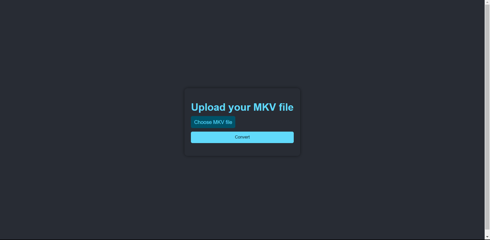

# MKV to MP4 Converter

MKV to MP4 Converter is a simple and efficient web application that allows users to convert their MKV video files to the widely supported MP4 format.

  <!-- You can add a screenshot of your app here -->

## Features:

- **User-Friendly Interface**: Easily upload and convert your MKV files with a few clicks.
- **Real-time Progress**: Track the conversion progress in real-time with a progress bar.
- **High-Quality Conversion**: Powered by FFmpeg to ensure high-quality output.

## Getting Started:

### Prerequisites:

- Node.js
- FFmpeg (can be bundled using `ffmpeg-static`)

### Installation:

1. Clone the repository:
   ```bash
   git clone https://github.com/Deepak-png981/MKV-TO-MP4-ConverterNodeJS.git
